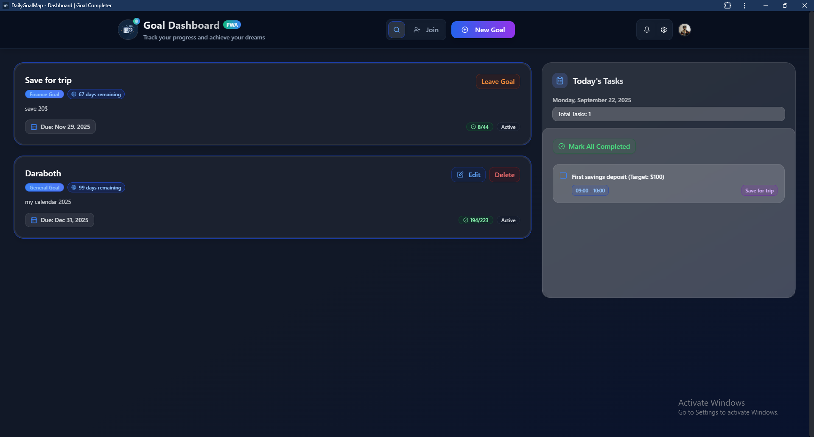
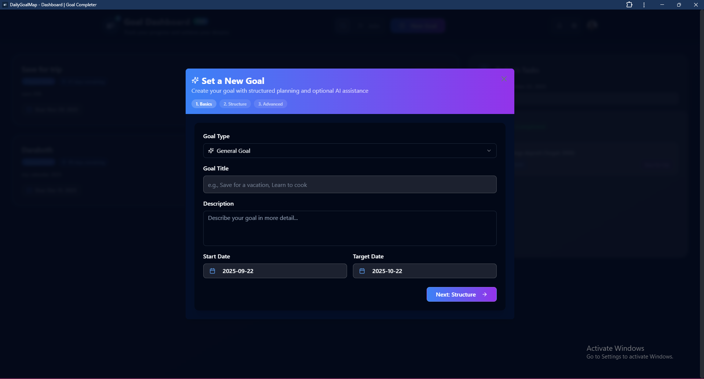
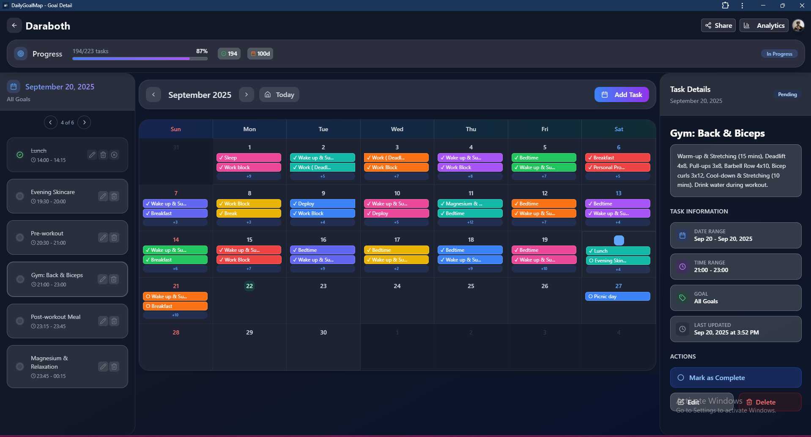
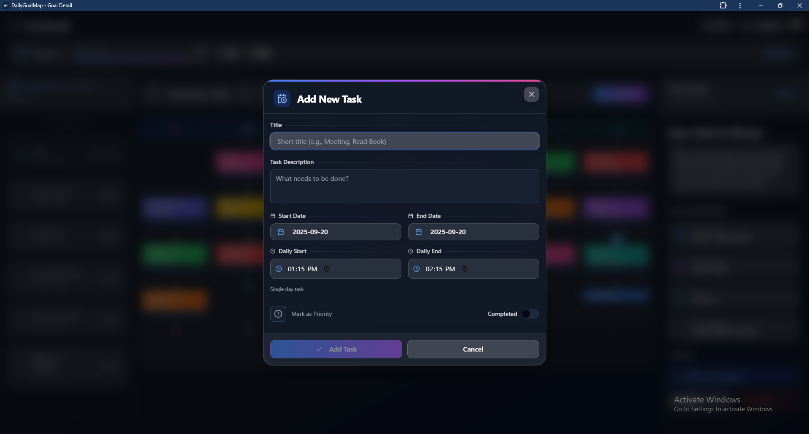

# Goal Tracker - AI-Powered Goal Management PWA

A modern, AI-powered Progressive Web Application for goal setting, task management, and progress tracking. Built with React, TypeScript, Supabase, and designed as a PWA for seamless mobile and desktop experiences.

## 🌟 Features

### Core Features
- **AI-Powered Goal Creation**: Generate structured goals with AI assistance
- **Smart Task Generation**: Automatically create tasks based on your goals using AI
- **Calendar Integration**: Visual calendar for task scheduling and management
- **Progress Tracking**: Real-time goal progress monitoring and analytics
- **Goal Sharing**: Collaborate with others by sharing goals and inviting members
- **Financial Planning**: Built-in budget calculator and savings projection tools
- **Deadline Management**: Smart notifications for upcoming deadlines

### Technical Features
- **Progressive Web App (PWA)**: Install on mobile and desktop devices
- **Offline Support**: Work offline with automatic sync when online
- **Real-time Updates**: Live notifications and data synchronization
- **Responsive Design**: Optimized for all screen sizes
- **Dark/Light Mode**: Automatic theme switching
- **Push Notifications**: Stay updated with goal progress and deadlines

## 🚀 Demo






## 🛠️ Tech Stack

- **Frontend**: React 18, TypeScript, Tailwind CSS
- **Routing**: TanStack Router
- **Backend**: Supabase (Database, Auth, Storage, Edge Functions)
- **UI Components**: Radix UI, shadcn/ui
- **Build Tool**: Vite
- **AI Integration**: OpenAI GPT, Google Gemini
- **Charts**: Recharts
- **PWA**: Service Worker, Web App Manifest
- **Mobile**: Capacitor (for native Android and iOS apps)

## 📱 Mobile App Setup

DailyGoalMap can run as a native mobile app on Android and iOS using Capacitor.

**Quick Start:**
```bash
npm install
npm run build
npx cap add android  # or 'ios'
npx cap sync
npx cap run android  # or 'ios'
```

**Mobile Features:**
- 📱 Native device reminders integration
- 🔔 Push notifications for team updates
- 💾 Offline functionality with sync
- 🎨 Touch-optimized UI
- 📲 Install as a native app

For detailed setup instructions, troubleshooting, and platform-specific guides, see [docs/MOBILE_SETUP.md](docs/MOBILE_SETUP.md).

## 📋 Prerequisites

Before you begin, ensure you have the following installed:
- [Node.js](https://nodejs.org/) (v18 or higher)
- [npm](https://www.npmjs.com/) or [yarn](https://yarnpkg.com/)
- [Supabase CLI](https://supabase.com/docs/guides/cli) (for local development)

## 🔧 Installation & Setup

### 1. Clone the Repository

```bash
git clone https://github.com/your-username/goal-tracker.git
cd goal-tracker
```

### 2. Install Dependencies

```bash
npm install
# or
yarn install
```

### 3. Environment Configuration

1. Copy the example environment file:
```bash
cp .env.example .env
```

2. Update the `.env` file with your Supabase credentials (see Supabase Setup section below)

### 4. Supabase Setup

#### Creating Your Supabase Project

1. Create a [Supabase account](https://supabase.com) if you don't have one
2. Create a new project in your Supabase dashboard
3. Wait for the project to be set up (this may take a few minutes)

#### Getting Your Supabase Credentials

1. Go to your project dashboard
2. Navigate to **Settings** > **API**
3. Copy the following values:
   - **Project URL** (looks like `https://your-project-ref.supabase.co`)
   - **Anon/Public Key** (starts with `eyJ...`)
   - **Project Reference ID** (the subdomain in your project URL)

4. Update your `.env` file:

```env
REACT_APP_NODE_ENV="development"
VITE_SUPABASE_URL="https://your-project-ref.supabase.co"
VITE_SUPABASE_ANON_KEY="your-anon-key-here"
VITE_SUPABASE_PROJECT_ID="your-project-ref"
```

#### Option B: Local Development with Supabase CLI

```bash
# Start local Supabase
supabase start

# This will provide you with local URLs and keys
```

### 5. Database Setup

The project includes complete database migrations in the `supabase/migrations/` directory. You need to run these to set up your database schema.

#### Method 1: Using Supabase Dashboard (Recommended)

1. Go to your Supabase project dashboard
2. Navigate to **SQL Editor**
3. Run the migration files in order:

**Step 1: Create the basic schema**
```sql
-- Copy and paste the contents of supabase/migrations/001_initial_schema.sql
-- This creates all the required tables: goals, tasks, user_profiles, etc.
```

**Step 2: Set up Row Level Security policies**
```sql
-- Copy and paste the contents of supabase/migrations/002_rls_policies.sql
-- This ensures data security and proper access control
```

**Step 3: Create database functions and triggers**
```sql
-- Copy and paste the contents of supabase/migrations/003_functions_and_triggers.sql
-- This adds helper functions and automatic triggers
```

**Step 4: Enable real-time functionality**
```sql
-- Copy and paste the contents of supabase/migrations/004_realtime_setup.sql
-- This enables real-time updates for collaborative features
```

#### Method 2: Using Supabase CLI (Advanced)

If you prefer using the CLI:

```bash
# Install Supabase CLI
npm install -g supabase

# Login to Supabase
supabase login

# Link your project (you'll need your project reference ID)
supabase link --project-ref your-project-ref

# Push the migrations
supabase db push
```

#### Database Schema Overview

The application uses these main tables:

| Table | Description |
|-------|-------------|
| `user_profiles` | Extended user information beyond auth |
| `goals` | Main goals created by users |
| `tasks` | Tasks associated with goals |
| `goal_members` | Goal sharing and collaboration |
| `notifications` | In-app notifications |
| `api_keys` | Encrypted storage for user API keys |
| `push_subscriptions` | Web push notification subscriptions |

#### Real-time Features

The following tables have real-time enabled for collaborative features:
- ✅ `goals` - Live goal updates
- ✅ `tasks` - Real-time task management  
- ✅ `goal_members` - Live member additions/removals
- ✅ `notifications` - Instant notifications
- ✅ `user_profiles` - Profile updates

### 6. Authentication Setup

1. In your Supabase dashboard, go to **Authentication** > **Settings**
2. Configure your URLs:
   - **Site URL**: `http://localhost:8080` (for development)
   - **Redirect URLs**: Add `http://localhost:8080/**` for development
   - For production: Add your actual domain (e.g., `https://yourdomain.com/**`)

3. **Email Settings** (Optional but Recommended for Development):
   - Go to **Authentication** > **Settings** > **SMTP Settings**
   - For faster testing, you can disable email confirmations:
     - Uncheck "Enable email confirmations"
   - Or set up SMTP for production email delivery

4. **Enable Providers** (Optional):
   - Go to **Authentication** > **Providers**
   - Enable social logins like Google, GitHub, etc., if desired

### 7. Edge Functions Setup

The project includes several Supabase Edge Functions for AI-powered features. You need to deploy these functions to enable full functionality.

#### Deploying Edge Functions

**Option 1: Using Supabase CLI (Recommended)**

```bash
# Deploy all functions at once
supabase functions deploy

# Or deploy individual functions
supabase functions deploy generate-tasks
supabase functions deploy generate-goal-chat
supabase functions deploy generate-daily-tasks
supabase functions deploy generate-chat-suggestions
```

**Option 2: Manual Deployment via Dashboard**

1. Go to **Edge Functions** in your Supabase dashboard
2. Create new functions with the following names and copy the respective code:

| Function Name | File Location | Purpose |
|---------------|---------------|---------|
| `generate-tasks` | `supabase/functions/generate-tasks/` | AI task generation |
| `generate-goal-chat` | `supabase/functions/generate-goal-chat/` | Goal-based AI chat |
| `generate-daily-tasks` | `supabase/functions/generate-daily-tasks/` | Daily task suggestions |
| `generate-chat-suggestions` | `supabase/functions/generate-chat-suggestions/` | Chat response suggestions |

#### Required Secrets for Edge Functions

Set up these secrets for AI functionality:

```bash
# Using Supabase CLI
supabase secrets set OPENAI_API_KEY=your_openai_api_key_here
supabase secrets set GEMINI_API_KEY=your_google_gemini_api_key_here

# Or set them via Dashboard: Project Settings > Edge Functions > Secrets
```

#### Getting API Keys

1. **OpenAI API Key** (Required for AI features):
   - Sign up at [OpenAI Platform](https://platform.openai.com)
   - Go to [API Keys](https://platform.openai.com/api-keys)
   - Create a new secret key
   - Add billing information (required for API usage)

2. **Google Gemini API Key** (Alternative AI provider):
   - Go to [Google AI Studio](https://makersuite.google.com/app/apikey)
   - Create a new API key
   - This is free tier available

### 8. Testing Your Setup

Before running the application, verify your Supabase setup:

1. **Test Database Connection**:
   - Go to **Table Editor** in your Supabase dashboard
   - You should see all the tables created by the migrations

2. **Test Authentication**:
   - Go to **Authentication** > **Users**
   - The table should be empty but accessible

3. **Test Edge Functions** (if deployed):
   - Go to **Edge Functions** in your dashboard
   - Your functions should be listed and deployable

## 📋 Complete Setup Documentation

**IMPORTANT**: You must set up your own Supabase instance to run this project.

For detailed setup instructions, see our comprehensive guides:

- **[🚀 SUPABASE.md](docs/SUPABASE.md)** - **START HERE** - Complete Supabase setup for developers
- **[📊 DATABASE_SCHEMA.md](docs/DATABASE_SCHEMA.md)** - **REQUIRED** - Complete SQL schema to run in your Supabase
- **[⚡ Edge Functions Guide](docs/EDGE_FUNCTIONS.md)** - AI functions deployment and configuration  
- **[🔄 Real-time Setup](docs/REALTIME_SETUP.md)** - Collaborative features configuration
- **[📖 Supabase Setup Guide](docs/SUPABASE_SETUP.md)** - Original detailed setup guide

### Quick Setup Steps:
1. Create a Supabase project at [supabase.com](https://supabase.com)
2. Run the complete database schema from `docs/DATABASE_SCHEMA.md` in your SQL Editor
3. Deploy Edge Functions from `supabase/functions/` directory
4. Configure authentication and environment variables
5. Set up AI API keys (OpenAI, Gemini) in Supabase secrets

## 🗄️ Database Schema

### Core Tables

| Table | Purpose | Key Features |
|-------|---------|--------------|
| `user_profiles` | Extended user data | Avatar, display name, device settings |
| `goals` | Main goal entities | Title, description, deadlines, sharing |
| `tasks` | Goal-related tasks | Scheduling, completion tracking |
| `goal_members` | Collaboration | Role-based access, sharing permissions |
| `notifications` | In-app messaging | Real-time updates, invitations |
| `api_keys` | Secure key storage | Encrypted AI API keys |
| `push_subscriptions` | Web push notifications | Device registration |

### Real-time Features

All tables support real-time updates for collaborative features:
```typescript
// Example: Listen to goal updates
supabase
  .channel('goal-changes')
  .on('postgres_changes', { 
    event: '*', 
    schema: 'public', 
    table: 'goals' 
  }, (payload) => {
    console.log('Goal updated:', payload)
  })
  .subscribe()
```

### Security Model

Row Level Security (RLS) policies ensure:
- ✅ Users only access their own data
- ✅ Shared goals respect member permissions  
- ✅ Public goals are readable by anyone
- ✅ Creators have full control over their goals
- ✅ API keys are encrypted and user-specific

## ⚡ Edge Functions

### AI-Powered Functions

| Function | Purpose | Authentication |
|----------|---------|----------------|
| `generate-tasks` | Smart task creation | Required |
| `generate-goal-chat` | AI goal assistant | Optional |
| `generate-daily-tasks` | Daily suggestions | Required |
| `generate-chat-suggestions` | Response suggestions | Optional |

### Function Deployment

```bash
# Deploy all functions
supabase functions deploy

# Set required secrets
supabase secrets set OPENAI_API_KEY=your_key_here
supabase secrets set GEMINI_API_KEY=your_key_here
```

For detailed function documentation, see [Edge Functions Guide](docs/EDGE_FUNCTIONS.md).

## 🚀 Running the Application

### Development

```bash
npm run dev
# or
yarn dev
```

The application will be available at `http://localhost:8080`

### Production Build

```bash
npm run build
# or
yarn build
```

### Preview Production Build

```bash
npm run preview
# or
yarn preview
```

## 📱 PWA Installation

The application is a Progressive Web App and can be installed on devices:

1. **Desktop**: Look for the install icon in your browser's address bar
2. **Mobile**: Use "Add to Home Screen" option in your browser menu
3. **iOS Safari**: Tap the Share button and select "Add to Home Screen"

## 🔐 Security & Privacy

- All sensitive data is stored securely in Supabase
- Row Level Security (RLS) policies protect user data
- API keys are encrypted and stored securely
- No data is shared without explicit user consent

## 🌍 Deployment

### Vercel (Recommended)

1. Connect your GitHub repository to Vercel
2. Set environment variables in Vercel dashboard
3. Deploy automatically on every push

### Netlify

1. Connect your repository to Netlify
2. Set build command: `npm run build`
3. Set publish directory: `dist`
4. Add environment variables

### Manual Deployment

```bash
# Build the project
npm run build

# Deploy the `dist` folder to your hosting provider
```

### Environment Variables for Production

Make sure to set these environment variables in your deployment platform:

```env
REACT_APP_NODE_ENV="production"
VITE_SUPABASE_PROJECT_ID="your-project-id"
VITE_SUPABASE_PUBLISHABLE_KEY="your-anon-public-key"
VITE_SUPABASE_URL="https://your-project-ref.supabase.co"
```

## 🧪 Testing

```bash
# Run tests
npm test

# Run tests with coverage
npm run test:coverage
```

## 🔧 Configuration

### Customizing the Application

1. **Branding**: Update logos in `public/logo/` directory
2. **PWA Configuration**: Modify `public/manifest.json`
3. **Theme**: Customize colors in `src/index.css` and `tailwind.config.ts`
4. **Goal Templates**: Edit `src/data/goalTemplates.ts`

### Feature Flags

Some features can be toggled in the codebase:
- AI task generation
- Real-time notifications
- Offline sync
- Goal sharing

## 📚 Project Structure

```
src/
├── components/          # Reusable UI components
│   ├── auth/           # Authentication components
│   ├── calendar/       # Calendar and task components
│   ├── dashboard/      # Dashboard components
│   ├── goal/          # Goal-related components
│   ├── notifications/ # Notification components
│   └── ui/            # Base UI components (shadcn/ui)
├── hooks/             # Custom React hooks
├── pages/             # Page components
├── routes/            # TanStack Router route definitions
├── services/          # API services and utilities
├── types/             # TypeScript type definitions
├── utils/             # Utility functions
└── integrations/      # Third-party integrations
    └── supabase/      # Supabase client and types

supabase/
├── functions/         # Edge Functions
├── migrations/        # Database migrations
└── config.toml       # Supabase configuration
```

## 🤝 Contributing

We welcome contributions! Please follow these steps:

1. Fork the repository
2. Create a feature branch: `git checkout -b feature/amazing-feature`
3. Commit your changes: `git commit -m 'Add amazing feature'`
4. Push to the branch: `git push origin feature/amazing-feature`
5. Open a Pull Request

### Development Guidelines

- Follow TypeScript best practices
- Use the existing component patterns
- Write responsive, mobile-first CSS
- Test your changes thoroughly
- Update documentation as needed

### Code Style

- Use TypeScript for all new code
- Follow the existing ESLint configuration
- Use Tailwind CSS for styling
- Follow React best practices and hooks patterns

## 🐛 Troubleshooting

### Common Issues

1. **Supabase Connection Issues**:
   - Verify your environment variables
   - Check if your Supabase project is active
   - Ensure RLS policies are properly configured

2. **AI Features Not Working**:
   - Verify API keys are configured
   - Check edge function logs in Supabase
   - Ensure you have sufficient API credits

3. **PWA Installation Issues**:
   - Ensure HTTPS is enabled in production
   - Check service worker registration
   - Verify manifest.json is accessible

4. **Build Failures**:
   - Clear node_modules and reinstall dependencies
   - Check for TypeScript errors
   - Ensure all environment variables are set

### Getting Help

- Check the [Issues](../../issues) page for known problems
- Create a new issue with detailed reproduction steps
- Join our community discussions

## 📝 License

This project is licensed under the MIT License - see the [LICENSE](LICENSE) file for details.

## 🙏 Acknowledgments

- [Supabase](https://supabase.com) for the excellent backend-as-a-service
- [TanStack Router](https://tanstack.com/router) for type-safe routing
- [shadcn/ui](https://ui.shadcn.com) for beautiful, accessible components
- [Tailwind CSS](https://tailwindcss.com) for utility-first styling
- [OpenAI](https://openai.com) and [Google](https://ai.google.dev) for AI capabilities

## 📞 Support

If you have any questions or need help getting started:

1. Check the troubleshooting section above
2. Look through existing [issues](../../issues)
3. Create a new issue with your question
4. Reach out to the maintainers

---

**Made with ❤️ for the open-source community**

Star ⭐ this repository if you find it helpful!